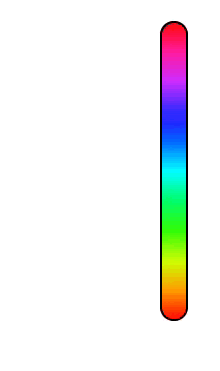

<p align="center">

</p>

---

ColorSlider is an iOS color picker with live preview written in [Swift](https://developer.apple.com/swift/).

[](https://travis-ci.org/gizmosachin/ColorSlider)  [](https://developer.apple.com/swift) [](LICENSE)

|           | Features                                 |
| :-------: | :--------------------------------------- |
| :ghost: | "[Snapchat](https://snapchat.com)-style" color picker |
| :rainbow: | Extensible live preview                  |
| :art: | Customizable appearance                  |
| :cyclone: | Vertical and horizontal support          |
| :musical_keyboard: | Black and white colors included          |
| :books: | Fully [documented](https://gizmosachin.github.io/ColorSlider) |
| :baby_chick: | [Swift 5](https://developer.apple.com/swift/) |

## Usage

Create and add a ColorSlider to your view:

``` Swift
let colorSlider = ColorSlider(orientation: .vertical, previewSide: .left)
colorSlider.frame = CGRect(x: 0, y: 0, width: 12, height: 150)
view.addSubview(colorSlider)
```

Respond to changes in color using `UIControlEvents`:

``` Swift
colorSlider.addTarget(self, action: #selector(changedColor(_:)), forControlEvents: .valueChanged)

func changedColor(_ slider: ColorSlider) {
    var color = slider.color
    // ...
}
```

Customize appearance attributes:

``` Swift
// Add a border
colorSlider.gradientView.layer.borderWidth = 2.0
colorSlider.gradientView.layer.borderColor = UIColor.white.cgColor

// Disable rounded corners
colorSlider.gradientView.automaticallyAdjustsCornerRadius = false
```

### Preview

`ColorSlider` has a live preview that tracks touches along it. You can customize it:

``` Swift
let previewView = ColorSlider.DefaultPreviewView()
previewView.side = .right
previewView.animationDuration = 0.2
previewView.offsetAmount = 50

let colorSlider = ColorSlider(orientation: .vertical, previewView: previewView)
```

Create your own live preview by subclassing `DefaultPreviewView` or implementing `ColorSliderPreviewing` in your `UIView` subclass.
Then, just pass your preview instance to the initializer:
``` Swift
let customPreviewView = MyCustomPreviewView()
let colorSlider = ColorSlider(orientation: .vertical, previewView: customPreviewView)
```
ColorSlider will automatically update your view's `center` as touches move on the slider. 
By default, it'll also resize your preview automatically. Set `colorSlider.autoresizesSubviews` to `false` to disable autoresizing.

To disable the preview, simply pass `nil` to ColorSlider's initializer:
``` Swift
let colorSlider = ColorSlider(orientation: .vertical, previewView: nil)
```

See the [documentation](https://gizmosachin.github.io/ColorSlider) for more details on custom previews.

### Documentation

ColorSlider is fully documented [here](https://gizmosachin.github.io/ColorSlider).

## Installation

### [CocoaPods](https://cocoapods.org/)

``` ruby
platform :ios, '9.0'
pod 'ColorSlider', '~> 4.4'
```

### [Carthage](https://github.com/Carthage/Carthage)

``` ruby
github "gizmosachin/ColorSlider" >= 4.4
```

## Version Compatibility

| Swift Version | ColorSlider Version |
| ------------- | ------------------- |
| 5.0           | master              |
| 4.2           | 4.3                 |

## Demo

Please see the `Demo` directory for a basic iOS project that uses `ColorSlider`.

## Contributing

ColorSlider is a community - contributions and discussions are welcome!

Please read the [contributing guidelines](CONTRIBUTING.md) prior to submitting a Pull Request.

## License

ColorSlider is available under the MIT license, see the [LICENSE](LICENSE) file for more information.
